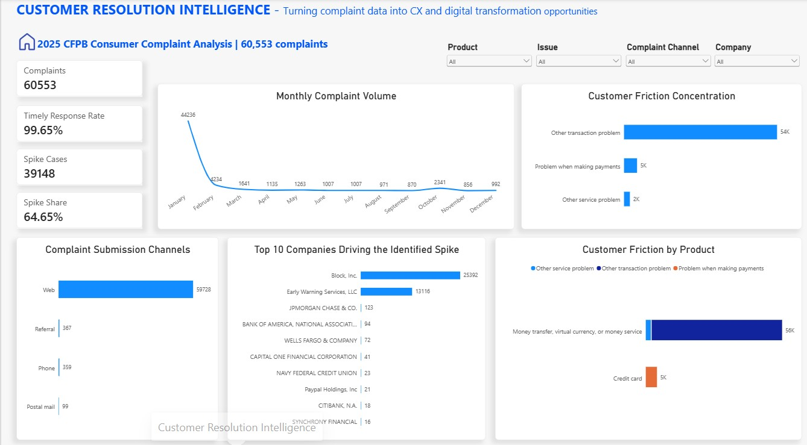
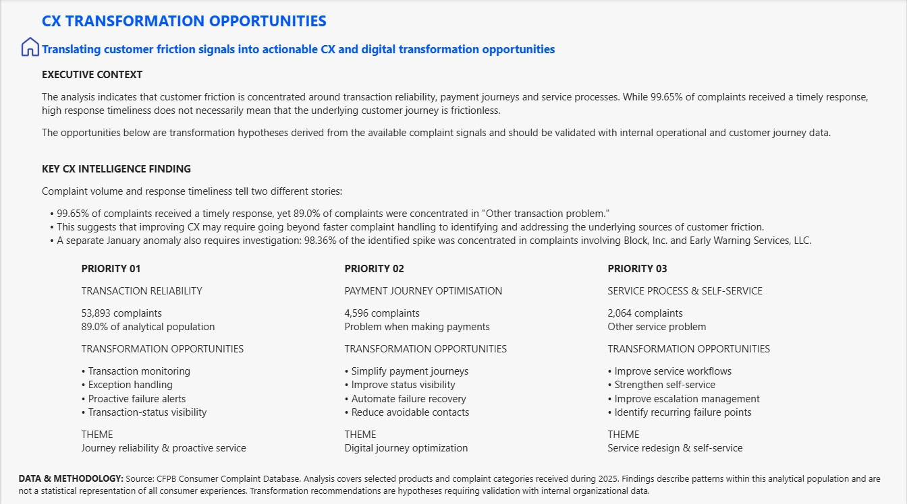
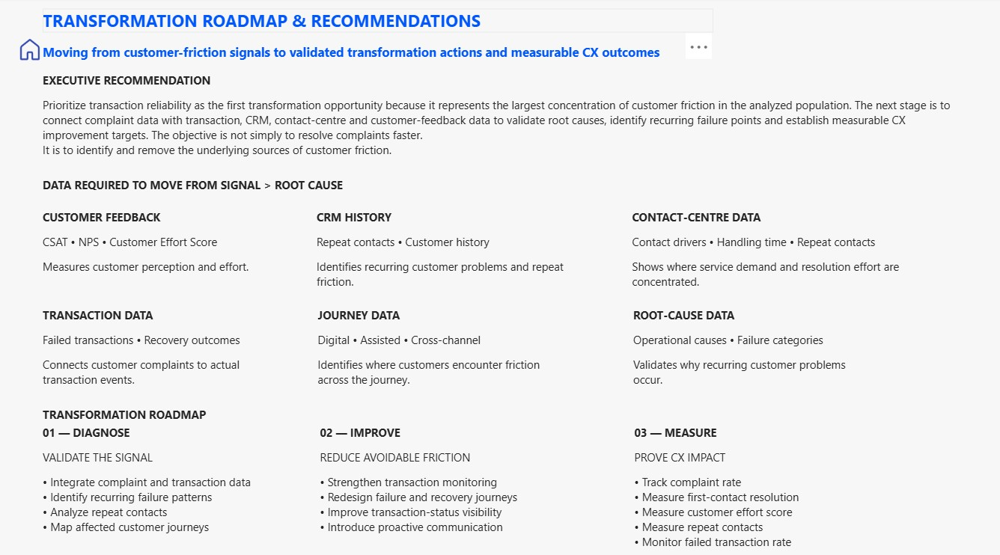

# Customer Resolution Intelligence

### Turning Customer Complaint Data into CX & Digital Transformation Opportunities


---

## Executive Summary

Customer complaints contain valuable signals about where service journeys are creating friction. However, strong complaint-response performance does not necessarily mean that the underlying customer experience is frictionless.

This project uses real-world consumer complaint data from the **CFPB Consumer Complaint Database** to identify where customer friction is concentrated, investigate unusual complaint patterns, prioritise CX improvement opportunities, and translate those signals into a practical transformation roadmap.

The project demonstrates how customer data can move through the following decision framework:

> **Customer Data → Friction Signals → CX Intelligence → Transformation Priorities → Action → Measurement**

The project does **not** claim to establish operational root causes because the public dataset does not contain the organisation-level transaction, CRM, contact-centre and customer-feedback data required for definitive root-cause validation.

Instead, it demonstrates how complaint data can be used as an initial **CX intelligence signal** to determine where deeper investigation and transformation should begin.

---

# Dashboard Preview

The Power BI solution is structured as a three-stage decision journey:

**Evidence → CX Intelligence → Transformation Action**

## Page 1 — Customer Resolution Intelligence

Answers:

> **What does the data show?**



---

## Page 2 — CX Transformation Opportunities

Answers:

> **What does the evidence mean?**



---

## Page 3 — Transformation Roadmap & Recommendations

Answers:

> **What should the organisation do next?**



## Business Problem

Organisations receive large volumes of customer complaints across products, channels and service journeys.

While complaint-handling metrics can show how quickly organisations respond, they do not necessarily explain:

- Why customers are experiencing friction
- Where customer problems are concentrated
- Which customer journeys require investigation
- Whether recurring complaints are connected to operational failures
- Which CX problems should receive transformation priority

### Core Business Question

> **How can organisations use customer complaint data to identify high-friction service issues, understand where resolution is breaking down, and prioritise CX improvements?**

---

## Business Questions

The analysis addresses five core questions:

1. **What are customers complaining about?**
2. **Where is customer friction concentrated?**
3. **Which problems are associated with the largest complaint concentrations?**
4. **Are there unusual periods or company-level concentrations that require investigation?**
5. **What CX and digital transformation opportunities should be prioritised based on the available signals?**

# Dataset

## Source

The project uses the **CFPB Consumer Complaint Database**, a public dataset maintained by the U.S. Consumer Financial Protection Bureau.

The database contains consumer complaints concerning financial products and services.

- [CFPB Consumer Complaint Database](https://www.consumerfinance.gov/data-research/consumer-complaints/)
- [CFPB Complaint Database Field Reference](https://cfpb.github.io/api/ccdb/fields.html)
- [CFPB Complaint Database Documentation](https://cfpb.github.io/api/ccdb/)

## Analysis Period

**January 1, 2025 – December 31, 2025**

## Analytical Population

The final analytical dataset contains:

**60,553 complaints**

The analysis focused on the following product categories:

- Checking or savings account
- Credit card
- Money transfer, virtual currency, or money service

The following issue categories were selected:

- Other transaction problem
- Problem when making payments
- Other service problem

> **Note:** The analytical population represents the selected products and issue categories used for this project. It is not the complete CFPB complaint database.

# Analytical Approach

The project follows a structured CX Intelligence workflow.


Real Customer Data
        ↓
Data Preparation
        ↓
Complaint Analysis
        ↓
Friction Identification
        ↓
Anomaly Investigation
        ↓
CX Prioritisation
        ↓
Transformation Opportunities
        ↓
Validation Data Requirements
        ↓
Transformation Roadmap
        ↓
CX Measurement


---

# SECTION 5 — Key Findings

# Key Findings

## 1. Complaint Volume

The analytical population contains:

> **60,553 complaints**

The largest issue category was:

> **Other transaction problem — 53,893 complaints**

This represents:

> **89.0% of the analytical population**

This makes transaction-related friction the dominant customer-friction signal within the analysed population.

---

## 2. Response Timeliness

The analysis found:

> **99.65% timely response rate**

This creates an important CX distinction:

> **Fast complaint response does not necessarily mean a frictionless customer journey.**

An organisation can respond to complaints quickly while still experiencing significant underlying customer friction.

This led to the central analytical question:

> **Are organisations optimising the speed of complaint resolution while leaving the underlying source of customer friction unresolved?**

---

## 3. January Complaint Anomaly

A significant concentration of complaints occurred during January.

The identified January 15–21 period contained:

> **39,148 complaints**

This represented:

> **64.65% of the full analytical population**

The spike was highly concentrated at company level.

**Block, Inc.** and **Early Warning Services, LLC** accounted for:

> **98.36% of the identified spike**

Further analysis showed that the spike was overwhelmingly associated with **domestic U.S. money transfer complaints** involving those two companies.

### Important interpretation

The January spike is treated as an **investigation signal**, not as evidence of a confirmed operational incident or root cause.

The public dataset does not provide sufficient internal operational context to establish causality.

# Central CX Intelligence Finding

The central finding of the project is:

> ## Complaint volume and response timeliness tell two different stories.

Although **99.65%** of complaints received a timely response, **89.0%** of the analytical population was classified as **Other transaction problem**.

This suggests that improving customer experience requires more than simply improving complaint-handling speed.

The deeper opportunity is to identify and remove the:

> **underlying sources of customer friction.**

# CX Transformation Priorities

Based on the available customer-friction signals, three transformation priorities were identified.

---

## Priority 01 — Transaction Reliability & Proactive Service

### Customer Signal

**53,893 complaints**

**89.0% of the analytical population**

### Transformation Opportunities

- Strengthen transaction monitoring
- Improve exception handling
- Introduce proactive failure alerts
- Improve transaction-status visibility

### Transformation Theme

**Journey reliability & proactive service**

---

## Priority 02 — Payment Journey Optimisation

### Customer Signal

**4,596 complaints**

classified as:

**Problem when making payments**

### Transformation Opportunities

- Simplify payment journeys
- Improve payment-status visibility
- Automate failure recovery
- Reduce avoidable customer contacts

### Transformation Theme

**Digital journey optimisation**

---

## Priority 03 — Service Process & Self-Service

### Customer Signal

**2,064 complaints**

classified as:

**Other service problem**

### Transformation Opportunities

- Improve service workflows
- Strengthen self-service
- Improve escalation management
- Identify recurring service-process failure points

### Transformation Theme

**Service redesign & self-service**

# Moving From Signal to Root Cause

Complaint data can identify customer-friction signals, but it does not provide the complete customer journey.

To move from **signal → root cause**, organisations would need to integrate additional data sources.

| Data Source | What It Helps Identify |
|---|---|
| Customer Feedback | CSAT, NPS and Customer Effort |
| CRM History | Repeat contacts and customer history |
| Contact-Centre Data | Contact drivers, handling time and repeat contacts |
| Transaction Data | Failed transactions and recovery outcomes |
| Customer Journey Data | Digital, assisted and cross-channel friction |
| Root-Cause Data | Operational causes and failure categories |

The desired analytical chain becomes:


Complaint
    ↓
Customer Journey
    ↓
Operational Event
    ↓
Root Cause
    ↓
Transformation Intervention
    ↓
Customer Outcome


---

# SECTION 9 — Executive Recommendation


# Executive Recommendation

The primary transformation opportunity is:

> **Transaction reliability**

because it represents the largest concentration of customer friction within the analysed population.

The recommended next step is to connect complaint data with:

- Transaction data
- CRM data
- Contact-centre data
- Customer feedback
- Customer journey data

This would allow an organisation to validate root causes, identify recurring failure points and establish measurable CX improvement targets.

The objective is not simply:

> **Resolve complaints faster.**

It is:

> **Identify and remove the underlying sources of customer friction.**

# CX Transformation Roadmap

## 01 — DIAGNOSE

### Validate the Signal

- Integrate complaint and transaction data
- Identify recurring failure patterns
- Analyse repeat contacts
- Map affected customer journeys
- Validate operational root causes

↓

## 02 — IMPROVE

### Reduce Avoidable Friction

- Strengthen transaction monitoring
- Redesign failure and recovery journeys
- Improve transaction-status visibility
- Strengthen self-service
- Introduce proactive customer communication

↓

## 03 — MEASURE

### Prove CX Impact

Track measurable customer and operational outcomes:

- Complaint rate
- First-contact resolution
- Customer Effort Score
- Repeat contact rate
- Failed transaction rate
- Resolution time
- Customer satisfaction

# CX Measurement Framework

Transformation initiatives should be evaluated using both **customer** and **operational** outcomes.

| Transformation Area | Example Success Measure |
|---|---|
| Transaction Reliability | Failed transaction rate |
| Complaint Resolution | First-contact resolution |
| Customer Effort | Customer Effort Score |
| Customer Satisfaction | CSAT |
| Repeat Friction | Repeat contact rate |
| Service Efficiency | Resolution time |
| Proactive Service | Failure notification coverage |

The objective is to determine whether transformation initiatives actually reduce customer effort and recurring friction rather than simply improving internal response metrics.

# Power BI Dashboard

The Power BI solution contains three pages.

## Page 1 — Customer Resolution Intelligence

### Purpose

**What does the data show?**

The analytical dashboard contains:

- Total complaints
- Timely response rate
- Identified spike cases
- Spike share
- Monthly complaint volume
- Customer problem concentration
- Complaint submission channels
- Companies driving the identified spike
- Customer friction by product
- Interactive filtering by:
  - Product
  - Customer problem
  - Complaint channel
  - Company

---

## Page 2 — CX Transformation Opportunities

### Purpose

**What does the evidence mean?**

This page translates analytical findings into:

- Executive context
- Key CX intelligence finding
- Customer-friction interpretation
- Three transformation priorities
- Data and methodology context

---

## Page 3 — Transformation Roadmap & Recommendations

### Purpose

**What should the organisation do next?**

This page contains:

- Executive recommendation
- Data required for root-cause validation
- CX transformation roadmap
- Diagnose → Improve → Measure framework
- CX measurement considerations

# Technology Stack

## Data Analysis

- Python
- Pandas

## Business Intelligence

- Microsoft Power BI
- DAX

## Development

- VS Code
- Git
- GitHub

## Data Source

- CFPB Consumer Complaint Database

# Project Structure

```

Customer-Resolution-Intelligence/
│
├── data/
│   ├── raw/
│   │   └── CFPB complaint dataset
│   │
│   └── processed/
│       └── complaints_clean.csv
│
├── notebooks/
│   └── Customer_Resolution_Intelligence.ipynb
│
├── powerbi/
│   └── Customer_Resolution_Intelligence.pbix
│
├── documentation/
│   └── 01_business_problem.md
│
└── README.md
```

---

# SECTION 15 — Methodology & Limitations


# Methodology & Limitations

This project is a **CX Intelligence prototype**, not an operational study of a specific financial institution.

## 1. Public Complaint Data

The CFPB Consumer Complaint Database represents complaints submitted to the CFPB and should not be interpreted as a statistical sample of all consumer experiences.

## 2. Analytical Population

The analysis covers selected products and issue categories rather than the entire CFPB database.

Therefore, the findings describe patterns within this analytical population.

## 3. Complaint Volume ≠ Customer Incidence

A high complaint volume does not necessarily mean that the same proportion of all customers experienced the underlying problem.

Complaint volume can be affected by factors such as:

- Customer base size
- Product adoption
- Market share
- Complaint behaviour
- Reporting practices
- External events

## 4. Company-Level Interpretation

Company-level complaint volume should be interpreted in the context of company size, customer base and market activity.

## 5. Root Cause Cannot Be Established From Complaint Data Alone

The public dataset does not provide sufficient internal operational information to establish definitive root causes.

For example, the analysis can identify a concentration of transaction-related complaints but cannot independently determine whether the underlying cause was:

- System failure
- Process failure
- Product design
- Communication failure
- Fraud controls
- Third-party dependency
- Customer behaviour
- External event

Additional organisational data would be required.

## 6. Transformation Recommendations Are Hypotheses

The transformation opportunities proposed in this project are analytical hypotheses derived from observed complaint patterns.

They should be validated using organisation-specific data before implementation.

# Project Outcome

This project demonstrates a practical framework for moving from customer data to transformation decision-making:

```
REAL CUSTOMER DATA
        ↓
DATA ANALYSIS
        ↓
CUSTOMER-FRICTION SIGNALS
        ↓
ANOMALY INVESTIGATION
        ↓
CX PRIORITISATION
        ↓
TRANSFORMATION OPPORTUNITIES
        ↓
ROOT-CAUSE DATA REQUIREMENTS
        ↓
TRANSFORMATION ROADMAP
        ↓
MEASURABLE CX OUTCOMES
```

---

# SECTION 17 — Skills Demonstrated


# Skills Demonstrated

## Customer Experience

- Customer-friction analysis
- Complaint analytics
- Voice-of-Customer thinking
- CX prioritisation
- Customer journey thinking
- Customer effort analysis
- Service improvement

## Business Intelligence

- Data preparation
- Exploratory data analysis
- KPI development
- Trend analysis
- Anomaly analysis
- Power BI dashboard development
- DAX
- Interactive reporting

## Digital Transformation

- Process improvement
- Journey optimisation
- Service redesign
- Self-service opportunities
- Proactive customer communication
- Transformation roadmap development
- Outcome measurement

## Strategic Analysis

- Business problem framing
- Hypothesis development
- Anomaly investigation
- Opportunity prioritisation
- Root-cause thinking
- Data requirements definition
- Executive recommendations

# Key Takeaway

The central lesson from this analysis is:

> **Customer experience improvement should not stop at resolving complaints quickly. Organisations need to understand why customers are experiencing friction in the first place.**

Complaint data can provide the initial signal.

The next step is connecting that signal to operational, transaction, CRM and customer-feedback data to identify root causes and design measurable transformation interventions.

# Disclaimer

This project is an independent portfolio analysis using publicly available CFPB consumer complaint data.

It is not affiliated with, sponsored by, or endorsed by the Consumer Financial Protection Bureau or any company referenced in the dataset.

The transformation recommendations are analytical hypotheses developed for portfolio and demonstration purposes and should not be interpreted as recommendations to any specific organisation without further validation.

---

# Data Sources

- [Consumer Financial Protection Bureau — Consumer Complaint Database](https://www.consumerfinance.gov/data-research/consumer-complaints/)
- [CFPB — Complaint Database Documentation](https://cfpb.github.io/api/ccdb/)
- [CFPB — Complaint Database Field Reference](https://cfpb.github.io/api/ccdb/fields.html)